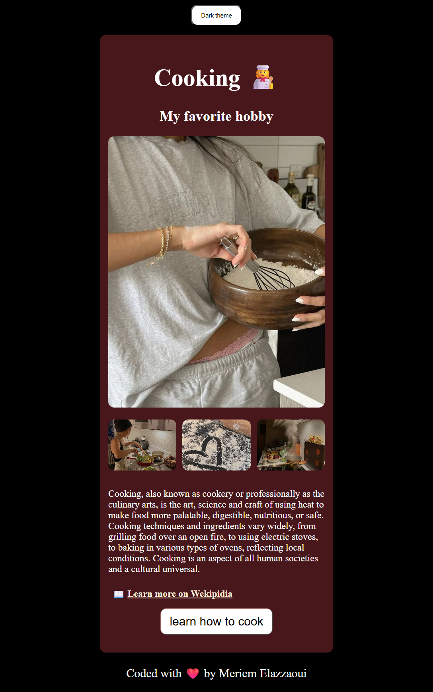
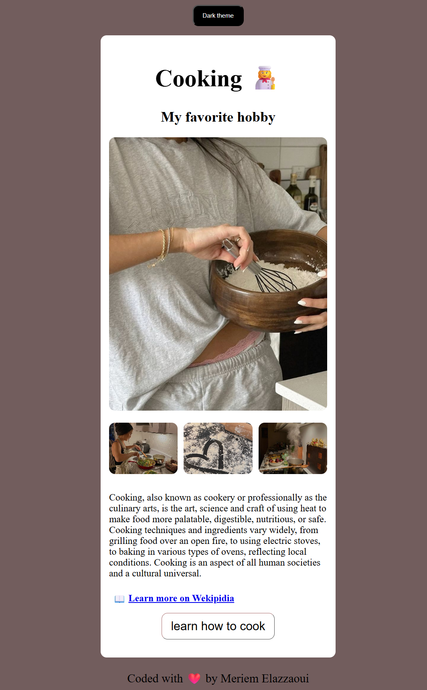

# Interactive Cooking Website

## Overview

This is an interactive cooking website built using HTML, CSS, and JavaScript.

The project focuses on frontend interactivity, theme switching, and handling user input dynamically.

Users can explore cooking content, switch between two visual themes, and interact with a feature that collects cuisine preferences and email input.

_Screenshots:_

<table align="center">
  <tr>
    <td></td>
    <td></td>
  </tr>
</table>

---

## Features

- Theme toggle (two custom themes)
- Interactive "Learn How to Cook" button
- User input for preferred cuisine
- Email input collection
- Personalized confirmation popup message
- External informational links (Wikipedia integration)

---

## Tech Stack

- HTML
- CSS
- JavaScript (Vanilla JS)

---

## How It Works

- JavaScript handles theme switching dynamically.
- When users click the "Learn How to Cook" button, they are prompted to enter:
  - The cuisine they want to learn
  - Their email address
- A confirmation message is displayed dynamically using DOM manipulation.

_Note: This is a frontend-only project. The email functionality does not send real emails and no backend is connected._

---

## Installation

1. Clone the repository:

   `git clone https://github.com/meriem837/interactive-cooking-website.git`

2. Open `index.html` in your browser.

_Or just [click here to view it live on Netlify](https://interactive-cooking-website.netlify.app/)._

---

## What I Practiced

- DOM manipulation
- Event listeners
- Theme switching logic
- Handling user input
- Dynamically updating the UI with JavaScript
